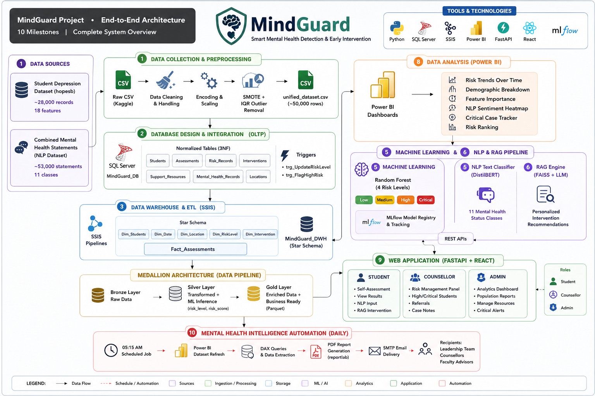

# 🧠 MindGuard – Smart Mental Health Detection & Early Intervention System

> An end-to-end AI-powered mental health intelligence platform that combines Data Engineering, Machine Learning, NLP, Retrieval-Augmented Generation (RAG), Business Intelligence, and Full-Stack Development to proactively identify at-risk students and deliver personalized intervention recommendations.

---
## 🏗 System Architecture

## 📖 Overview

MindGuard is an AI-powered mental health intelligence system designed to help universities detect students at risk of depression and other mental health conditions before they become critical. The platform integrates data engineering, machine learning, natural language processing, retrieval-augmented generation (RAG), business intelligence, and web technologies into one unified solution.

The system processes structured student survey data alongside free-text mental health statements, predicts risk levels using machine learning, analyzes emotions using NLP, generates evidence-based personalized recommendations through RAG, and provides interactive dashboards for counsellors and university administrators.

---

## ✨ Key Features

- 📊 Data Collection & Preprocessing Pipeline
- 🗄 SQL Server OLTP Database (3NF)
- 🔄 SSIS ETL & Data Warehouse
- 🏛 Medallion Architecture (Bronze → Silver → Gold)
- 🤖 Random Forest Mental Health Risk Prediction
- 🧠 DistilBERT NLP Mental Health Classification
- 🔍 FAISS-based Retrieval-Augmented Generation (RAG)
- 📈 Power BI Interactive Dashboards
- 🌐 FastAPI + React Web Platform
- ⚡ Automated Daily Reporting & Email Notifications

---

## 🏗 System Architecture

```text
Student Depression Dataset
Mental Health Statements
          │
          ▼
Data Cleaning & Preprocessing
(Pandas, SMOTE, Scaling)
          │
          ▼
SQL Server (MindGuard_DB)
          │
          ▼
SSIS ETL Pipelines
          │
          ▼
MindGuard Data Warehouse
          │
          ▼
Bronze → Silver → Gold
          │
          ├────────► Machine Learning
          ├────────► NLP
          ├────────► RAG
          ├────────► Power BI
          └────────► FastAPI + React
                           │
                           ▼
      Students • Counsellors • Administrators
```

---

## 🤖 Machine Learning

- Random Forest Classifier
- Four-Level Risk Prediction
  - Low
  - Medium
  - High
  - Critical
- Feature Engineering
- SMOTE Class Balancing
- MLflow Model Registry
- Feature Importance
- ROC-AUC & F1 Evaluation

---

## 🧠 NLP

Fine-tuned DistilBERT model capable of classifying free-text mental health statements into multiple categories including:

- Depression
- Anxiety
- Stress
- Bipolar
- PTSD
- OCD
- Schizophrenia
- Eating Disorder
- Personality Disorder
- Suicidal
- Normal

---

## 🔍 RAG Pipeline

The Retrieval-Augmented Generation system retrieves relevant information from a curated knowledge base including WHO Mental Health Guidelines, university counselling policies, CBT resources, and crisis hotline information.

Pipeline:

Student Input → DistilBERT → Embeddings → FAISS Search → LLM → Personalized Recommendation

---

## 📈 Analytics

Power BI dashboards provide:

- Mental Health Trends
- Risk Distribution
- Critical Case Monitoring
- Student Ranking
- Feature Importance
- Demographic Analysis
- NLP Sentiment Trends
- Executive Reports

---

## 🌐 Web Platform

Built with:

- FastAPI
- React
- Tailwind CSS

### Student
- Self Assessment
- Risk Prediction
- NLP Analysis
- AI Recommendations

### Counsellor
- High Risk Monitoring
- Critical Alerts
- Student Referrals

### Administrator
- Analytics Dashboard
- Reports
- User Management
- System Monitoring

---

## ⚙ Technology Stack

### Backend
- FastAPI
- Python

### Frontend
- React
- Tailwind CSS

### Database
- SQL Server

### Data Warehouse
- SSIS
- SQL Server

### Machine Learning
- Scikit-learn
- Random Forest
- MLflow

### NLP
- Hugging Face Transformers
- DistilBERT

### RAG
- FAISS
- Sentence Transformers
- LLM APIs

### Analytics
- Power BI
- DAX

### Automation
- Python
- ReportLab
- SMTP

---

## 📂 Project Structure

```text
MindGuard/
│
├── data/
├── database/
├── etl/
├── ml/
├── nlp/
├── rag/
├── backend/
├── frontend/
├── powerbi/
├── reports/
├── docs/
└── README.md
```

---

## 📊 Datasets

### Student Depression Dataset
- ~28,000 records
- 18 structured features

### Combined Mental Health Statements
- ~53,000 text samples
- 11 mental health classes

---

## 🚀 Project Outcomes

- Early detection of mental health risks.
- AI-powered personalized intervention recommendations.
- End-to-end data engineering pipeline.
- Real-time machine learning predictions.
- NLP-powered mental health analysis.
- Automated reporting and dashboards.
- Unified platform for students, counsellors, and administrators.

---
## Our Team: 

